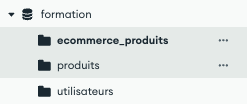
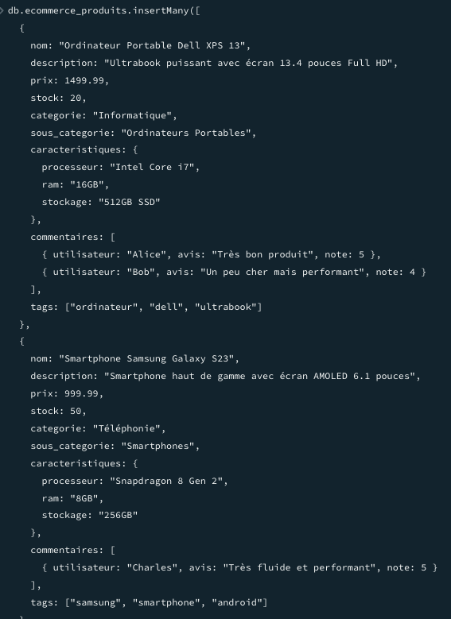
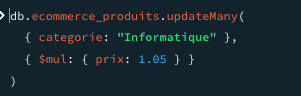

### Exo1

1. Création d’une collection "ecommerce_produits"

    

2. Insertion d’au moins 10 produit

    


### Exo2

1. récuperer tous les produits d'une categorie
```json
db.ecommerce_produits.find({categorie: "Informatique"})
```

2. Trouver les produits dont le prix est entre 50€ et 200€
```json
db.ecommerce_produits.find({prix: {$gt: 50, $lt: 200}})
```

3. Lister les produits en stock (stock > 0)
```json
db.ecommerce_produits.find({stock: {$gt: 0}})
```

4. Trouver les produits avec au moins 3 avis
```json
db.ecommerce_produits.find({commentaires: {$size: 3}})
```

### Exo3

1. Augmenter le prix de tous les produits d'une catégorie de 5%

    

2. Ajouter un champ "promotion" à certains produits
```json
db.ecommerce_produits.updateMany({prix: {$gt: 100}}, {$set: {promotion: true}})
```

3. Ajouter un nouveau tag à tous les produits d'une catégorie
```json
db.ecommerce_produits.updateMany({categorie: "Informatique"}, {$push: {tags: "clavier"}})
```

4. Mettre à jour le stock après une "vente"


### Exo4

1. Trouver les produits disponibles avec tag1 ET tag2
```json
db.ecommerce_produits.find({tags: {$all: ["tag1", "tag2"]}})
```

2. Lister les produits premium avec un stock faible (<5)
```json
db.ecommerce_produits.find({stock: {$lt: 5}})
```

3. Rechercher les produits ayant reçu au moins un avis 5 étoiles
```json
db.ecommerce_produits.find({commentaires: {$elemMatch: {note: 5}}})
```
4. Trouver les produits d'une catégorie, triés par prix décroissant, limités aux 5 premiers
```json
db.ecommerce_produits.find({categorie: "Informatique"}).sort({prix: -1}).limit(5)
```