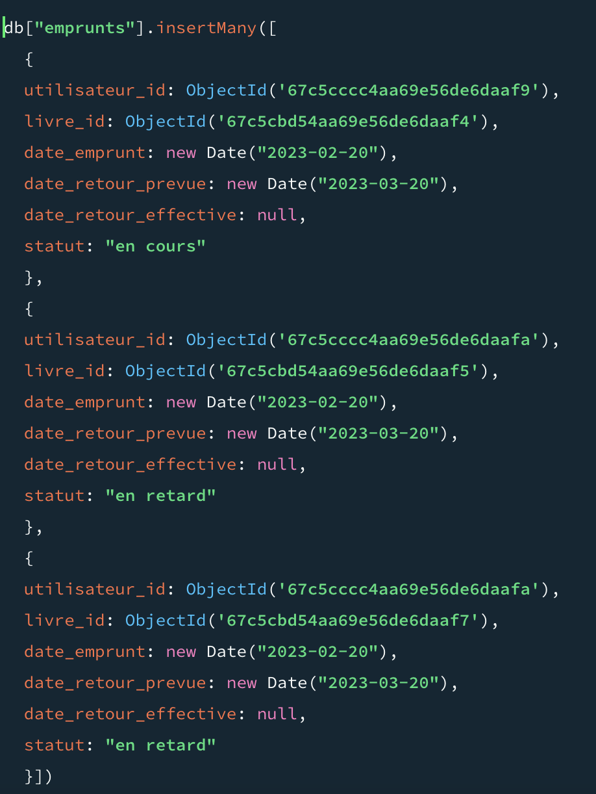

## Partie 2

1. Listez tous les livres disponibles 
```json
db.livres.find({disponible: true})
```

2. Trouvez les livres publiés après l'an 2000
```json
db.livres.find({annee_publication: {$gt: 2000}})
```

3. Trouvez les livres d'un auteur spécifique
```json
db.livres.find({auteur: "J.K. Rowling"})
```

4. Trouvez les livres qui ont une note moyenne supérieure à 4
```json
db.livres.find({note_moyenne: {$gt: 4}})
```

5. Listez tous les utilisateurs habitant dans une ville spécifique
```json
db.utilisateurs.find({"adresse.ville": "Bordeaux"})
```

6. Trouvez les livres qui appartiennent à un genre spécifique
```json
db.livres.find({genre: "Fantasy"})
```

7. Trouvez les livres qui ont à la fois un prix inférieur à 15€ et une note moyenne supérieure à 4
```json
db.livres.find({$and: [{prix: {$lt: 15}}, {note_moyenne: {$gt: 4}}]})
```

8. Trouvez les utilisateurs qui ont emprunté un livre spécifique (par titre)
```json
db.utilisateurs.find({"livres_empruntes.titre": "Les Misérables"})
```

## Partie 3

1. Mettez à jour le titre d'un livre spécifique
```json
db.livres.updateOne({titre: "Harry Potter à l'école des sorciers"}, {$set: {titre: "Harry Potter et la pierre philosophale"}})
``` 

2. Ajoutez un champ stock à tous les livres avec une valeur par défaut de 5
```json
db.livres.updateMany({}, {$set: {stock: 5}})
```

3. Marquez un livre comme indisponible (disponible = false)
```json 
db.livres.updateOne({titre: "Harry Potter et la pierre philosophale"}, {$set: {disponible
: false}})
```

4. Ajoutez un nouvel emprunt dans la liste livres_empruntes d'un utilisateur

5. Changez l'adresse d'un utilisateur
```json
db.utilisateurs.updateOne({nom: "Durand"}, {$set: {"adresse.rue": "1 rue de la Paix"}})
```

6. Ajoutez un nouveau tag à un utilisateur
```json
db.utilisateurs.updateOne({nom: "Durand"}, {$push: {tags: "Lecteur"}})
```

7. Mettez à jour la note moyenne d'un livre
```json
db.livres.updateOne({titre: "Harry Potter et la pierre philosophale"}, {$set: {note_moyenne: 4.5}})
```

### partie 4

1. Supprimez un livre spécifique par son titre
```json
db.livres.deleteOne({titre: "Le Comte de Monte-Cristo"})
```
2. Supprimez tous les livres d'un auteur spécifique
```json
db.livres.deleteMany({auteur: "Victor Hugo"})
```
3. Supprimez un utilisateur par son email
```json
db.utilisateurs.deleteOne({email: "paul.durand@example.com"})
```


### Partie 5

1. Listez tous les livres triés par note moyenne (ordre décroissant)
```json
db.livres.find().sort({note_moyenne: -1})
```
2. Trouvez les 3 livres les plus anciens
```json
db.livres.find().sort({annee_publication: 1}).limit(3)
```
3. Comptez le nombre de livres par auteur
```json
db.livres.aggregate([{$group: {_id: "$auteur", count: {$sum: 1}}}])
```
4. Affichez uniquement le titre, l'auteur et la note moyenne des livres (sans l'id)
```json
db.livres.find({}, {titre: 1, auteur: 1, note_moyenne: 1, _id: 0})
```
5. Trouvez les utilisateurs qui ont emprunté plus d'un livre
```json
db.utilisateurs.find({livres_empruntes: { $gt: 1 } } )
```
6. Recherchez les livres dont le titre contient un mot spécifique (utilisez $regex)
```json
db.livres.find({titre: {$regex: "Harry Potter"}})
```
7. Trouvez les livres dont le prix est entre 10€ et 20€
```json
db.livres.find({prix: {$gt: 10, $lt: 20}})
```


## Partie 6

### 6.1

1. Créez une nouvelle collection emprunts qui utilise des références vers les livres et les utilisateurs
2. Insérez au moins 3 emprunts dans cette collection

    

3. Comparez cette approche avec celle où les emprunts sont directement intégrés dans le document utilisateur
 
Cette approche permet de séparer les données des emprunts des données des utilisateurs et des livres. Cela permet de garder les données plus propres et de ne pas dupliquer les données des livres et des utilisateurs dans chaque emprunt. Cela permet également de gérer plus facilement les emprunts et de les retrouver plus facilement.

### 6.2

1. Quels sont les avantages et inconvénients de chaque approche ?

les avantages de la première approche sont que les données sont plus propres et plus faciles à gérer. Les inconvénients sont que cela nécessite plus de requêtes pour récupérer les données des emprunts.
les avantages de la deuxième approche sont que les données sont plus faciles à récupérer et à manipuler. Les inconvénients sont que les données sont plus redondantes et moins propres.

2. Quelle approche privilégieriez-vous pour une application réelle et pourquoi ?

Je privilégierais la première approche pour une application réelle car elle permet de garder les données plus propres et plus faciles à gérer. Cela permet également de mieux séparer les données et de les retrouver plus facilement.

3. Comment modéliseriez-vous les cas où un même livre peut exister en plusieurs exemplaires ?

